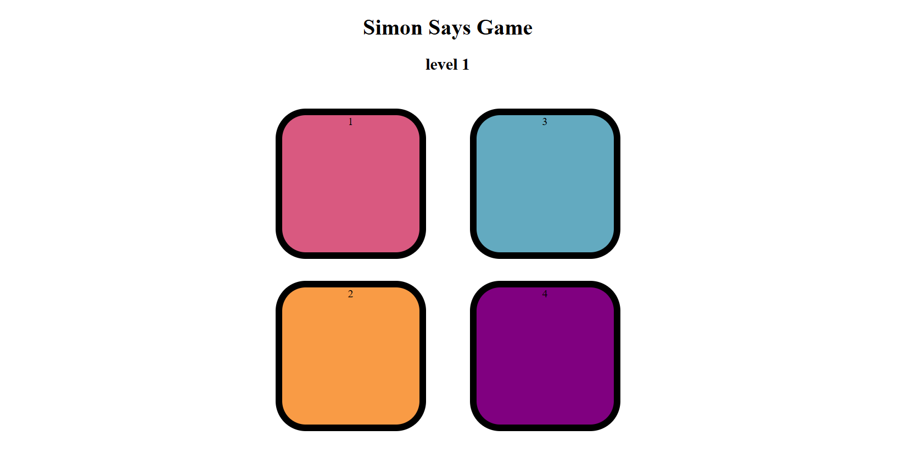
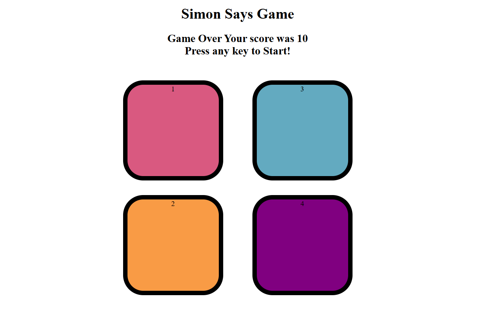

# Simon Says Game

## Overview
The **Simon Says Game** is a fun memory-based game built using **HTML, CSS, and JavaScript**. The game tests the player's ability to remember and repeat a sequence of colors. The sequence gets progressively longer with each level, making the game more challenging as the player progresses.

## How to Play
1. The game starts with a single color flashing.
2. The player must click on the flashed color to proceed.
3. The game then adds another color to the sequence and repeats it.
4. The player must remember and click the colors in the correct order.
5. If the player clicks the wrong color, the game ends and the final score is displayed.
6. The goal is to reach the highest possible level before making a mistake.

## Features
- Interactive UI with four color buttons.
- Increasing difficulty with every level.
- Visual and audio feedback for correct and incorrect inputs.
- Score tracking system displaying the highest level achieved.
- Fully responsive design.

## Technologies Used
- **HTML**: Structure of the game.
- **CSS**: Styling and animations for the buttons.
- **JavaScript**: Game logic and event handling.

## Installation & Setup
1. Clone the repository:
   ```sh
   git clone https://github.com/your-username/simon-says-game.git
   ```
2. Navigate to the project folder:
   ```sh
   cd simone
   ```
3. Open `index.html` in a browser to start playing.


## Preview



